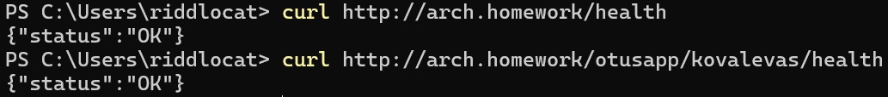
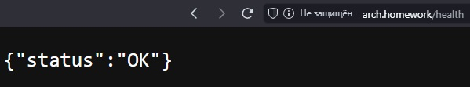
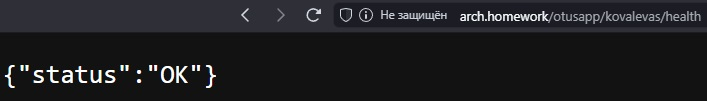

# 🔥 Домашнее задание #3

> - Создать веб-сервис, который:
>    - Отвечает на порту 8000
>    - Имеет HTTP-метод `GET http://*:8000/health`, возвращающий `{ "status": "OK" }`
> - Собрать Docker-образ приложения под архитектуру AMD64 и опубликовать его на Docker Hub
> - Написать манифесты для деплоя веб-сервиса в Kubernetes:
>    - Манифесты должны описывать сущности Deployment, Service, Ingress
>    - В Deployment необходимо указать Liveness, Readiness пробы
>    - Количество реплик должно быть не менее двух
>    - Необходимо использовать образ, загруженный на Docker Hub
>    - Необходимо назначить хост arch.homework в Ingress
>    - После применения манифестов GET-запрос на URL http://arch.homework/health должен возвращать объект `{ "status": "OK" }`
> - В Ingress должно быть правило, перенаправляющее все запросы с `/otusapp/{studentName}/*` на `arch.homework/health` (например, выполнение команды `curl arch.homework/otusapp/akovalev/health` перенаправит запрос на `arch.homework/health`)

### Создание объектов Deployment, Service и Ingress

Для создания объектов Deployment, Service и Ingress необходимо в каталоге, содержащем манифесты `deployment.yaml`, `service.yaml` и `ingress.yaml` выполнить следующую команду:

```text
kubectl apply -f .\deployment.yaml -f .\service.yaml -f .\ingress.yaml
```

### Настройка Ingress

После установки Ingress через Helm можно дополнительно настроить проброс портов для удобства дальнейшей работы:

```text
kubectl port-forward --namespace=nginx-ingress service/nginx-ingress-nginx-controller 80:80
```

Также желательно в файле `hosts` добавить хост `arch.homework` с IP-адресом minikube (или указать `localhost`, если используется Kubernetes, идущий в составе Docker Desktop).
После выполнения вышеуказанных операций получить доступ к сервису можно будет как из браузера, так и из командной строки без дополнительного указания внешнего порта сервиса `nginx-ingress-nginx-controller`.

#### Доступ к сервису из командной строки



#### Доступ к сервису из браузера




